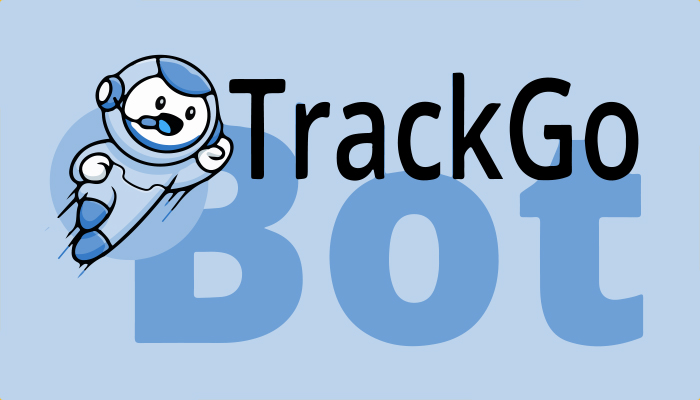

# TrackGo Bot - TypeScript UPDATE

> Gerencie e monitore encomendas através de um simples bot no Telegram. Limite-se a informar seus Tracks e deixe o resto com o TrackGo Bot.

## Sobre o projeto

TrackGo é um projeto simples, em desenvolvimento, feito para solucionar uma demanda pessoal para rastreio de encomendas do Correios Brasil.

De forma simples e direta, você pode adicionar seus rastreios de cartas e encomendas, gerenciar cada um deles individualmente e receber atualizações automáticas!
Tenha todas as informações dos seus Tracks a uma mensagem de distância com a nossa aplicação!

### Recursos adicionados
> Algumas melhorias e recursos foram migrados da primeira versão do TrackGo e implementado na atual versão.

- [x] Adaptação da versão 1.0.0 para TypeScript
- [x] Unificar API e BOT em um único serviço
- [x] Simplificar requisições ao banco de dados (agora utilizando banco NoSQL)
- [x] Adicionar suporte a multi-usuários
- [x] Cadastro de usuário via Token (durante a fase de testes de convidados)
- [x] Sistema de autenticação de usuários (evitar utilização de não convidados)
- [x] Sistema de timeout para espera do servidor por respostas do cliente
- [x] Adicionar instruções de boas-vindas e comandos de ajuda
- [x] Melhoria das mensagens (mais objetivas)
- [x] Navegação facilitada com botões de navegação in-line, menu de instruções e comandos interativos
- [x] Adicionado feedback flutuante de ações
- [x] Resolver bug que impede atualização imediata de novas Tracks

### Ajustes e melhorias

O projeto ainda está em desenvolvimento e próximas atualizações serão voltadas nos seguintes recursos:

- [ ] Adicionar opção para ligar ou desligar as atualizações automáticas
- [ ] Prevenir spam de mensagens pelo cliente
- [ ] Adicionar outras transportadores (Atualizações Futuras)
- [ ] Bugs menores...

## ☕ Usando o TrackGo Bot

Para utilizar o TrackGo Bot, basta iniciar uma conversa no [chat do Telegram](https://t.me/@TrackGo_Bot) :)

### Comandos do chat

> `/start` - O começo de tudo

> `/entrar 'SEU_TOKEN_AQUI'` - Registre-se no TrackGo Bot com seu convite

> `/ajuda` - Lista todos os comando disponíveis

> `/adicionar` - Adiciona um novo Track

> `/listar` - Lista todos os seus Tracks cadastrados

> `/sobre` - Informações sobre o Track Go

## 🤝 Reconhecimentos

* [@finotilucas - Correios Brasil v3.0.3](https://www.npmjs.com/package/correios-brasil)
* [Logo part by catalyststuff](http://www.freepik.com)

## 🙋🏾‍♂️ Autor

* [Igor Oliveira](https://github.com/reedbluue) - Just another person

## 😄 Seja um dos contribuidores

Quer fazer parte desse projeto? Clique [AQUI](./CONTRIBUTING.md) e leia como contribuir.

## 📝 Licença

Esse projeto está sob licença. Veja o arquivo [LICENÇA](./LICENSE) para mais detalhes.